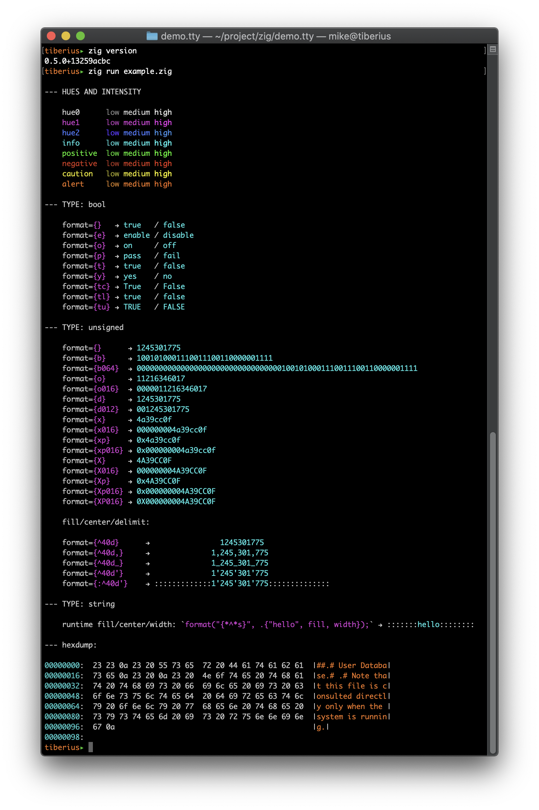

# demo.tty
short demo of a virtual TTY (teleprinter) device for Zig with xterm256-color support

`zig run example.zig`

- intermixes string formatting with tty primitives
- offers simple indent/dedent push/pop mechanism
- models a set of hues independent of actual color: { hue0, hue1, hue2, info, positive, negative, caution, alert }
- supports a few basic zig types: { `[] const u8`, `bool`, `unsigned-int` }
- formatting is evolving
- lots still to be done



#### unstable grammer/wishlist:

```
format_string := <item> *
item := <text> | <maybe_replacement>
maybe_replacement := '{' '{' | '}' '}' | <replacement>
replacement := '{' [arg_index '/'] [spec] ['!' coercion] '}'
arg_index := <unsigned>
spec := bool_spec | unsigned_spec | signed_spec | float_spec | string_spec | pointer_spec
coercion := 'bool' | 'unsigned' | 'signed' | 'float' | 'string' | pointer' | 'type'

bool_spec     := [[fill] align] [width] [bool_style [bool_case]]
unsigned_spec := [[fill] align] [width] [unsigned_style ['p' | 'P'] ['\'' | '_' | ','] [['0'] iwidth]]
signed_spec   := [[fill] align] [width] [signed_style ['+'] ['p' | 'P']  ['\'' | '_' | ','] [['0'] iwidth]]
float_spec    := [[fill] align] [width] [float_style ['+'] ['p' | 'P']  ['\'' | '_' | ','] [['0'] iwidth] ['.' fwidth]]
string_spec   := [[fill] align] [width] [string_style]
pointer_spec  := [[fill] align] [width] [pointer_style ['_'] [['0'] iwidth]]
type_spec     := [[fill] align] [width] [type_style]

fill  := not ( '{' | '}' | align )
align := '<' | '>' | '^'
width := <unsigned>
 
bool_style     := 'e' | 'o' | 'p' | 't' | 'y'
bool_case      := 'c' | 'l' | 'u'
unsigned_style := 'b' | 'o' | 'd' | 'x' | 'X'
signed_style   := 'b' | 'o' | 'd' | 'x' | 'X'
float_style    := 'e' | 'E' | 'f' | 'F' | '%'
string_style   := 's'
pointer_style  := 'p' | 't' | 'x'
type_style     := TODO

bool_case := 'l', 'u', 'c'

note: positional parameters:
- fill: '*' and arg must be u8 or []const u8
- width, iwidth, fwidth: '*' and arg must be unsigned
```
